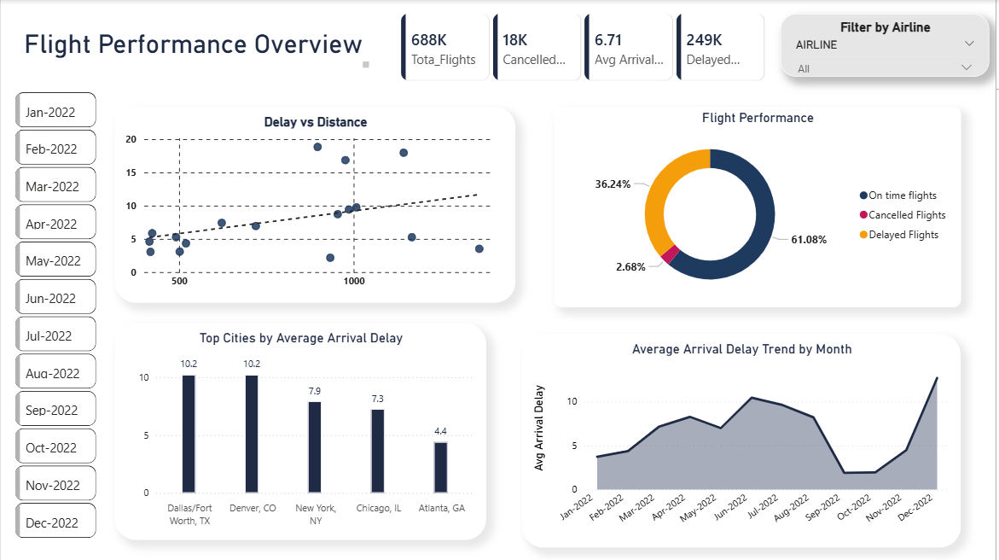
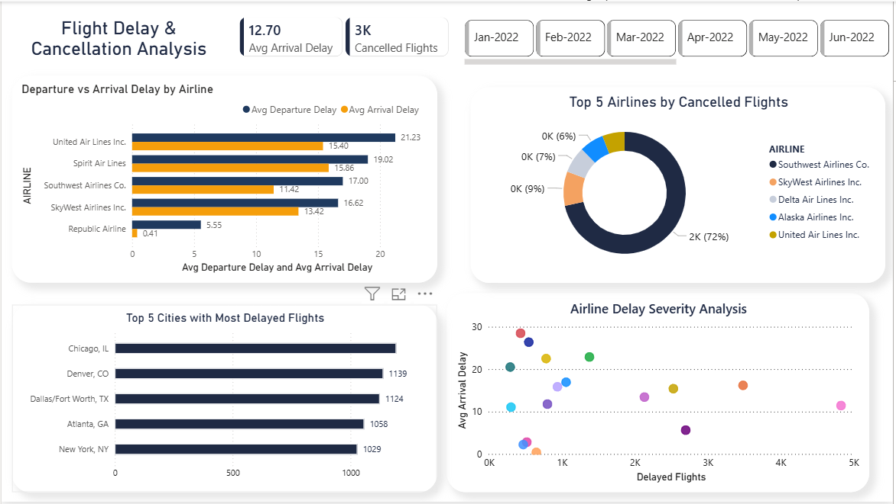

# Flight Delay & Cancellation Analysis - Power BI

## Project Overview
This project presents an interactive **Power BI dashboard** analyzing flight delays and cancellations across airlines and cities.  
The dashboard helps identify delay trends, airline performance, and city-level patterns in flight disruptions.

---

## Dataset
The dataset contains airline performance data including:

- Flight Date
- Airline
- Origin City
- Destination City
- Departure Delay
- Arrival Delay
- Flight Distance
- Cancelled Flights
- Diverted Flights

---

## Dashboard Preview

### Page 1 – Flight Performance Overview

Key elements:
- Total Flights
- Delayed Flights
- Cancelled Flights
- Average Arrival Delay
- Monthly delay trends
- Distance vs Arrival Delay analysis

---

### Page 2 – Delay & Cancellation Analysis

Key elements:
- Average Departure vs Arrival Delay by Airline
- Top Airlines by Cancelled Flights
- Cities with Most Delayed Flights
- Airline Delay Severity Analysis

---

## Tools Used
- Power BI
- Power Query
- DAX

---

## Key Insights
- Chicago shows the highest number of delayed flights
- Some airlines consistently experience higher average delays
- Delay patterns vary significantly across months
- Airline performance differs in both departure and arrival delays

---

## How to Use
1. Download the `.pbix` file from this repository  
2. Open it in **Power BI Desktop**  
3. Interact with the dashboard using filters and slicers
