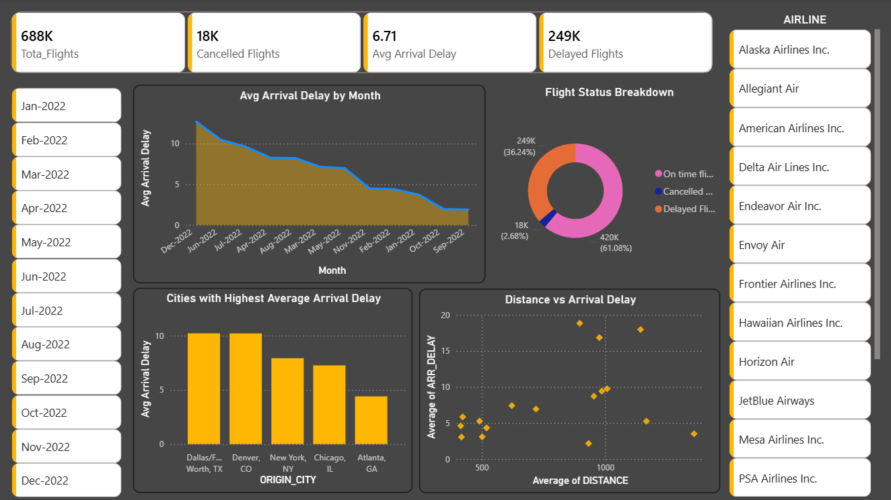
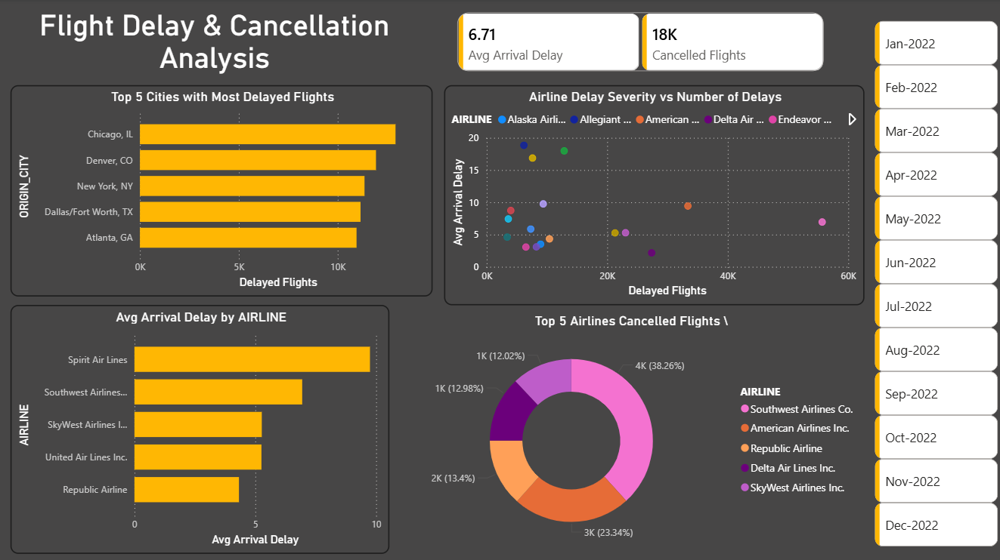

# Flight Delay & Cancellation Analysis - Power BI

## Project Overview
Interactive Power BI dashboard analyzing flight delays and cancellations across airlines and cities.

## Project Dataset
The dataset includes airline performance data with information on delays, cancellations, distance, and city-level trends.

## Dashboard Preview

### Page 1 - Overview

### Page 2 - Airline Analysis

## Tools Used
- Power BI
- DAX
- Power Query

## Key Insights
- Chicago has highest delayed flights
- Spirit Airlines shows higher average delay
- Delay trends vary by month

## How to Use
Download the .pbix file and open in Power BI Desktop.
